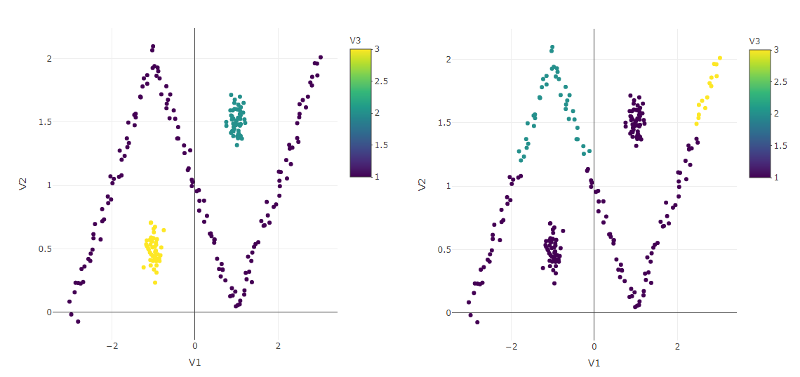

```{r setup, include=FALSE}
knitr::opts_chunk$set(echo = TRUE)
knitr::opts_chunk$set(fig.pos= 'H')
```

# 1. Wprowadzenie
Tematem drugiej pracy domowej była analiza podziału zbioru danych na skupienia (ang. *data clustering*). Jest to metoda klasyfikacji bez nadzoru. Polega na automatycznym pogrupowaniu zbioru danych na rozłączne klasy pod względem pewnego "podobieństwa" punktów. Podobne sobie punkty tworzą jedno określone skupienie.


## Algorytmy klasteryzacji

Problem grupowania danych może być rozwiązany za pomocą wielu algorytmów. Za Wikipedią, dzielą się one na:  

* algorytmy hierarchiczne
* grupy metod k-średnich
* metody rozmytej analizy skupień.


## Jaki jest cel zadania?

Zadanie 2. pracy domowej tak naprawdę składało się z wielu poleceń. Pierwszym, być może najciekawszym krokiem było samodzielne stworzenie funkcji dokonującej podziały zbioru danych na skupienia. Następnie, korzystając z bibliotek `stats`, `genie` oraz innej, wybranej przez siebie, należało dokonać porównania skuteczności różnych funkcji dokonujących grupowania na kilkudziesięciu zbiorach testowych. Oprócz tego, należało stworzyć kilka własnych zbiorów danych do testowania owych algorytmów. Opis owych zbiorów danych znajduje się w załączonym pliku *testy*. Ostatecznie, liczba wszystkich zbiorów testowych wyniosła 46, zawierają one współrzędne punktów w $\mathbb{R}^2$, $\mathbb{R}^3$, a także w $\mathbb{R}^4$.

\newpage

# 2. Wybrane algorytmy analizy skupień

## Pakiet `stats`

Pakiet `stats` zawiera rodzinę hierarchicznych algorytmów wbudowanych w funkcji `hclust()`.  
Metody do wyboru to: *Single*, *Complete*, dwie *metody Warda*, *metoda McQuitty'ego*, *median* oraz *centroidów*. W celu porównania, wypróbowane zostały wszystkie z nich.

## Algorytm `genie`

Jak można przeczytać w opisie funkcji `hclust2()` pakietu `genie`, jest to szybki algorytm hierarchiczny. Owa funkcja zawiera parametr *thresholdGini* - liczbę z przedziału [0,1], próg indeksu *Gini*, którego przetestowane zostały różne wartości.

## Pakiet `cluster`

Dowolnie wybraną bilioteką z archiwum *CRAN* została `cluster` wraz z funkcją `agnes()` oferującą kilka hierarchicznych funkcji. Próbując wszystkie z dostępnych metod na kilku zbiorach benchmarkowych (z katalogu *graves*) otrzymałem następujące wyniki:
```{r agnes, echo=FALSE}
options(stringsAsFactors = FALSE)
t(read.csv("agnestest.csv")) -> agnestest
colnames(agnestest) <- agnestest[1,]
agnestest <- agnestest[-1,]
data.frame(agnestest) -> agnestest
colnames(agnestest) <- "Index mean"
knitr::kable(agnestest)
```

Ponadto, metoda *Single* charakteryzowała się jednym z krótszych czasów działania. Mimo to warto nadmienić, że zazwyczaj działała ona dłużej niż wszystkie 7 metod funkcji `hclust()`.  


Opisane dotychczas algorytmy hierarchiczne zostały przetworzone za pomocą funkcji `cutree()` w celu otrzymania właściwej listy etykiet.

\newpage

## Algorytm spektralny
Funkcja stworzona samodzielnie jest implementacją algorytmu spektralnego, korzystającego choćby z M najbliższych sąsiadów czy algorytmu k-średnich.

To właśnie parametr M mógł być modyfikowany, co na potrzeby eksperymentu czyniłem.  
Początkowo odnosiłem wrażenie, że im większą przyjmiemy wartość M, tym wynik powinien być wyższy. Z tego powodu przyjąłem 4 wartości M, zależne od liczby punktów zbioru oraz liczby klas. Kolumna `ownq1` przyjmuje za M 25% liczby obserwacji, `own2q` 50%, `own3q` 75%, a `own` - liczbę: $\frac{liczba\ obserwacji}{liczba\ oczekiwanych\ grup}$.  
Po kilku testach zrozumiałem, że M powinno oscylować wokół kilku, kilkunastu. Z tego powodu przyjąłem wartości M: 5, 10, 12, 15. Zdecydowałem się jednak nie porzucać otrzymanych wyników i pozostały one w wynikach testów jako materiał badawczy.

# 3. Sprawdzenie skuteczności
## Indeksy
Skuteczność poszczególnych algorytmów sprawdzona zowstała za pomocą dwóch narzędzi: indeksu Fowlkesa-Mallowsa(FM) oraz skorygowanego indeksu Randa(AR). Odpowiednie funkcje znajdują się w bibliotekach `dendextend` oraz `mclust`. Oba indeksy zwracają wartości nie większe od 1, gdzie 1 oznacza w pełni poprawny podział zbioru na klastery, a im dalej od tej wartości, tym gorszy był wynik działania algorytmu.

## Standaryzacja
Dodatkowym czynikiem, mającym wpływ na skuteczność algorytmów analizy skupień, jest standaryzacja danych. Odpowiada za nią funkcja `scale()` w bazowym *R*.

# 4. Otrzymane wyniki testów na zbiorach

## Standaryzacja

Sprawdzimy najpierw, jak na wyniki osiągi sprawdzanych funkcji wpłynęła wspomniana standaryzacja.
```{r wczytanie, include=FALSE, cache = TRUE}
options(stringsAsFactors = FALSE)
read.csv("nicefinal.csv") -> nicefinalcsv
rownames(nicefinalcsv) <- nicefinalcsv[,1]

nicefinalcsv <- data.frame(round(nicefinalcsv[,-1], 5))

```

```{r standaryzacja, echo=FALSE, cache=TRUE, dependson="wczytanie"}
split(unlist(nicefinalcsv), rep(1:2, each=length(unlist(nicefinalcsv))/2))[[1]] -> noscaled
split(unlist(nicefinalcsv), rep(1:2, each=length(unlist(nicefinalcsv))/2))[[2]] -> scaled

data.frame(cbind(mean(noscaled), mean(scaled))) -> srednie
colnames(srednie) <- c("Bez standaryzacji", "Po standaryzacji")
rownames(srednie) <- "Średni indeks"

knitr::kable(srednie)
```

Jak widać, wartości indeksów wyliczanych nazbiorach bez standaryzacji są minimalnie wyższe, zatem wpływa ona negatywnie na skuteczność algorytmów. Sprawdźmy zatem, w ilu przypadkach, uwzględniając jedynie sytuacje, w których otrzymane wyniki były różne, brak standaryzacji korzystnie wpłynął na wynik badania. (*Figure 2*)

```{r standaryzacja2, echo=FALSE, cache=TRUE, dependson="standaryzacja", paged.print=FALSE, fig.cap="Jak często wyniki przed standaryzacją były wyższe niz po?"}
c(mean(noscaled[noscaled!=scaled]>scaled[noscaled!=scaled]),
  mean(noscaled[noscaled!=scaled]<scaled[noscaled!=scaled])) -> toPie

pie(toPie, labels=c("Przed standaryzacją (56%)", "Po standaryzacji (44%)"), col =c( "#005ce6", "#ffffff"))

```

W związku z osiągniętymi rezultatami, w dalszej części będziemy zajmować się jedynie indeksami otrzymanymi na zbiorach nieskalowanych.

```{r modyfikacja, dependson = "wczytanie", include = FALSE, cache = TRUE}
nicefinalcsv[,1:46] -> nicefinalcsv2
unlist(strsplit(colnames(nicefinalcsv2), split=".non.scaled")) -> colnames(nicefinalcsv2)

```

\newpage 

## Działanie indeksów 

Sprawdźmy zatem, który z indeksów sprawdzających skuteczność klasteryzacji był dla zbiorów bardziej surowy, obliczając ich średnie wartości na wszystkich zbiorach.

```{r indeksy, echo=FALSE, dependson = "modyfikacja", cache=TRUE }
split(unlist(nicefinalcsv2), rep(1:2, each=length(unlist(nicefinalcsv2))/2)) -> indeksy
sapply(indeksy, mean) -> srednie_indeksy
# data.frame(srednie_indeksy) -> srednie_indeksy
attr(srednie_indeksy, "names") <- c("Indeks Randa", "Indeks Fowlkes-Mallowsa")
#colnames(srednie_indeksy) <- "Średni indeks"
barplot(srednie_indeksy, col = "#4d9900", ylim=c(0, 0.8))

```

A czy wyniki działania obu indeksów były zbieżne? Sprawdzimy to na podstawie średnich wyników indeksów dla każdejz funkcji grupujących, badając następnie ich korelację:

```{r zbiezne, echo=FALSE, cache=TRUE, dependson="indeksy"}

sapply(split(indeksy[[1]], rep(1:(ncol(nicefinalcsv2)/2), each=ncol(nicefinalcsv2))), mean) -> ar
sapply(split(indeksy[[2]], rep(1:(ncol(nicefinalcsv2)/2), each=ncol(nicefinalcsv2))), mean) -> fm

data.frame(cor(ar, fm)) -> korelacja
colnames(korelacja) <- "Wartość korelacji"
knitr::kable(korelacja)
```


Jak widzimy, wartość współczynnika korelacji między średnimi indeksów jest wysoka, zatem oba indeksy bardzo podobnie oceniały skuteczność algorytmów. Ponieważ zachodzi taka zależność, weźmy pod uwagę "łagodniejszy" z nich: indeks Fowlkesa-Mallowsa.

```{r modyfikacja2, cache=TRUE, dependson="modyfikacja", include=FALSE}
nicefinalcsv2[(ncol(nicefinalcsv2)/2+1):ncol(nicefinalcsv2)] -> nicefinalcsv3
unlist(strsplit(colnames(nicefinalcsv3), split=".FM")) -> colnames(nicefinalcsv3)

```


## Sprawdzenie wyników algorytmów spektralnych

```{r own, echo=FALSE, cache=TRUE, dependson="modyfikacja2"}
nicefinalcsv3[,16:23] -> spektralny

sapply(split(unlist(spektralny), rep(1:ncol(spektralny), each=nrow(spektralny))) , mean) -> spektralnymean
attr(spektralnymean, "names") <- c("q1", "2q", "3q", "5",  "10", "12", "15", "own") 
barplot(sort(spektralnymean, decreasing=T), col = "#e68a00", ylim=c(0, 1), ylab="FM")
```

Wynik tej analizy może być zaskakujący. Największą skutecznością wykazała się funkcja, której wartość *M* była modyfikowana w zależności od liczby elementów zbioru. Przypomnijmy,
$M = \frac{liczba\ obserwacji}{liczba\ oczekiwanych\ grup}$. Dostrzegalny może być nieznaczny wzrost skuteczności funkcji między M równym 5 i 10 a 12 i 15. Najgorzej - bez zaskoczenia - wypadła wersja `own3q`.

\newpage

## Analiza algorytmów biblioteki `genie`

Funkcja `hclust()` z biblioteki `genie` została testowana dla różnych wartości *threshold*. Sprawdźmy, który z nich najlepiej sobie poradził z powierzonym mu zadaniem:

```{r genie, echo=FALSE, cache=TRUE, dependson="modyfikacja2"}
nicefinalcsv3[,9:14] -> genies
sapply(split(unlist(genies), rep(1:ncol(genies), each=nrow(genies))), mean) -> geniesmean
attr(geniesmean, "names") <- colnames(genies)
barplot(sort(geniesmean, decreasing=T), ylim=c(0, 1), col="#5900b3", ylab="FM")

```

Gwoli ścisłości - wartości odpowiadające słupkom zostały posortowane malejąco:

```{r genie 2, echo=FALSE, cache=TRUE, dependson="genie"}
knitr::kable(t(sort(geniesmean, decreasing=T)))

```


Domyślna wartość wspomnianego parametru - 0.3 - okazała się być najlepszą. Im bardziej *threshold* się od niej różnił, tym słabsze wychodziły wyniki podziału zbioru. Różnice między różnymi wartościami były niewielkie.

## Metody funkcji `hclust()`

```{r hclust, echo=FALSE, cache=TRUE, dependson="modyfikacja2"}
nicefinalcsv3[,1:8] -> hclusts
sapply(split(unlist(hclusts), rep(1:ncol(hclusts), each=nrow(hclusts))), mean) -> hclustsmean
attr(hclustsmean, "names") <- c("Comp.", "Ward", "Ward2", "Singl.", "Aver.", "McQ.", "Med.", "Centr.")
barplot(sort(hclustsmean, decreasing=T), ylim=c(0, 1), col="#990033", ylab="FM")

```

Spośród rodziny algorytmów dunkfcji `hclust()` najwyższą skuteczność osiągnęła metoda Warda.

\newpage

## Porównanie funkcji pochodzących z różnych źródeł
Czas rozstrzygnąć, która z wszystkich, 23 modyfikacji funkcji, okazała się być najlepszą. Do prezentacji wykorzystam najlepsze wersje funkcji z biblioteki `genie` oraz spośród własnego algorytmu spektralnego. Wśród wypisanych w dotychczasowych podpunktach nie znalazła się jeszcze metoda *Single* funkcji `agnes()`.


```{r podsumowanie, echo=FALSE, cache=TRUE, dependson="modyfikacja2"}
nicefinalcsv3[,c(1:9, 15, 23)] -> podsuma
sapply(split(unlist(podsuma), rep(1:ncol(podsuma), each=nrow(podsuma))), mean) -> podsumamean
attr(podsumamean, "names") <- c("Compl.", "Ward", "Ward2", "HSing.", "Aver.", "McQuit.", "Median", "Centr.", "Genie",
                                "ASing.", "Own")
barplot(sort(podsumamean, decreasing=T)[1:7], ylim=c(0, 1), col="#009999", ylab="FM")


```


Pojedynek skuteczności funkcji do analizy spektralnej wygrywa `hclust2()` z biblioteki `genie`, osiągając średnią wartość współczynnika FM **0.87**. Jak wspomniałem, wartość domyślna współczynnika *threshold* okazała się optymalna. Na następnych miejscach zostały sklasyfikowane algorytmy z `hclust()`, jednak róznica między 1. a 2. miejscem jest znacząca i wynosi 13%.

\newpage

# 5. Uwagi

## 5.1 Czas działania

```{r czasy, echo=FALSE, message=FALSE, warning=FALSE, cache=TRUE}
source("spectral.R")
library(genie)
library(cluster)
library(dplyr)
pliki <- list.files("F://Projekt//graves", pattern="*data")
plikilabels <- list.files("F://Projekt//graves", pattern="*labels")

HComplete <- function(Z){
  hclust(Z) %>% cutree(k=nofcluster)
}


HWard <- function(Z){
  hclust(Z, method="ward.D") %>% cutree(k=nofcluster)
}

HWard2 <- function(Z){
  hclust(Z, method = "ward.D2") %>% cutree(k=nofcluster)
}
HSingle <- function(Z){
  hclust(Z, method = "single") %>% cutree(k=nofcluster)
}

HAverage <- function(Z){
  hclust(Z, method = "average") %>% cutree(k=nofcluster)
}


  
HMcQuitty <- function(Z){
  hclust(Z, method = "mcquitty") %>% cutree(k=nofcluster)
}
HMedian <- function(Z){
  hclust(Z, method = "median") %>% cutree(k=nofcluster)
}
HCentroid <- function(Z){
  hclust(Z, method = "centroid") %>% cutree(k=nofcluster)
}

ASingle<- function(Z){
  agnes(Z, method = "single") %>% cutree(k=nofcluster)
}

GENIE <- function(Z){
  hclust2(Z) %>% cutree(k=nofcluster)
}

OWN <- function(X){
  spectral_clustering(X, nofcluster, round(nrow(X)/nofcluster))$cluster
}


for(i in 1:length(pliki)){
X <- read.csv(paste("F://Projekt//graves//", pliki[i], sep=""), header=F, sep=" ")
Y <- read.csv(paste("F://Projekt//graves//", plikilabels[i], sep=""), header=F)
Z <- dist(X)
nofcluster <- max(Y)


mcomplete <- microbenchmark::microbenchmark(HComplete(Z), times=10L)

mwardD <- microbenchmark::microbenchmark( HWard(Z), times=10L)

mwardD2 <- microbenchmark::microbenchmark(HWard2(Z), times=10L)

msingle <- microbenchmark::microbenchmark( HSingle(Z), times=10L)

maverage <- microbenchmark::microbenchmark( HAverage(Z), times=10L)

mmcquitty <- microbenchmark::microbenchmark(HMcQuitty(Z), times=10L)

mmedian <- microbenchmark::microbenchmark(HMedian(Z), times=10L)

mcentroid <- microbenchmark::microbenchmark(HCentroid(Z), times=10L)

agnessingle <- microbenchmark::microbenchmark(ASingle(Z), times=10L)


mgenie <- microbenchmark::microbenchmark(GENIE(Z), times=10L)

own <- microbenchmark::microbenchmark(OWN(X), times=10L)


ifelse(i==1, rbind(mcomplete, mwardD, mwardD2, msingle, maverage, mmcquitty, mmedian, mcentroid, mgenie, agnessingle, 
                   own) ->  times, times <-rbind(times, mcomplete, mwardD, mwardD2, msingle, maverage, mmcquitty,
                                                mmedian, mcentroid, mgenie, agnessingle, own))
}
```

```{r czasy2, echo=FALSE,  message=FALSE, warning=FALSE, cache=TRUE, dependson="czasy"}
print(times,  signif=5)
```


Czas działania testowanych funkcji był różny. Jak widać w tabeli stworzonej na podstawie analizy zbiorów z *graves* - najszybciej swoje działania wykonywały `hclust()`, które osiem swoich metod obliczały szybciej niż jedna `agnes()`. Niewiele wolniej zadziałał `genie`. Niestety, na drugim biegunie znalazł się algorytm spektralny własnej implementacji. Brak użycia pętli nie wystarczył, a najwolniej w nim działała zdecydowanie funkcja `eigen()`, poszukująca wektory oraz wartości własne laplasjanu. Krytycznie źle algorytmy zachowywały się obsługując większe zbiory danych - zawierające ponad 5000 punktów. Mnogość funkcji, szeroka gama zbiorów testowych, modyfikacje, a także i błędy, spoodowały, że obliczenia przygotowane z myślą o poniższym raporcie trwały dobre kilkadziesiąt godzin.


## 5.2 Algorytm *Single* z `agnes()`

Metoda *Single* pojawiła się w naszych badaniach dwukrotnie - w przypadku funkcji `hclust()` oraz `agnes()`. Nie powinny zatem dziwić orzymane podobne wyniki. Mimo bliskiej siebie skuteczności, funkcja z biblioteki `stats` działała znaczniej szybciej od `agnes()`, co niestety dyskredytuje tę drugą.

## 5.3 Wczytywanie plików

Jedną z zalecanych metod wczytywania plików jest wykorzystanie pętli `for`. Uznałem jednak, że w przypadku tego ćwiczenia, zbiorów benchmarkowych nie jest jeszcze aż tak wiele i wygodniej mi będzie pozostać przy dobrze mi znanej "ręcznej" metodzie wczytywania danych. Tworzona przeze mnie tablica zawierała 4 wymiary, w zależności od indeksu, skalowania, zbioru danych oraz funkcji. Jej zapis do pliku *.csv* spłaszczył ją do dwóch wymiarów.

## 5.4 Wykorzystane biblioteki

Oprócz wspomniany już bibliotek zawierających zaimplementowane algorytmy analizy skupień, w wykonaniu poniższego projektu pomogły mi także inne biblioteki. Są to: `plotly`, `movMF`, `igraph`, `abind`, a także - w drobnej mierze - `dplyr`.


# 6. Ilustracje

Poniżej prezentuję kilka najciekawszych moim zdaniem grafiki przedstawiających pracę różnych algorytmów do analizy skupień zbiorów danych.





