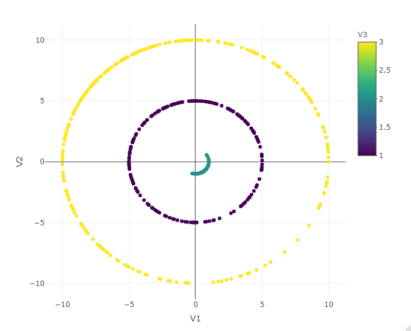
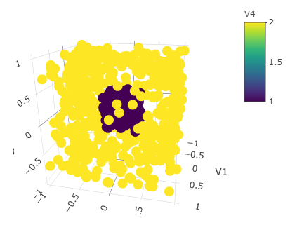
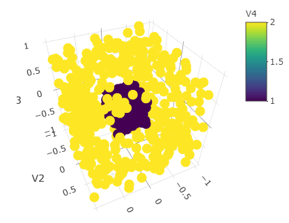
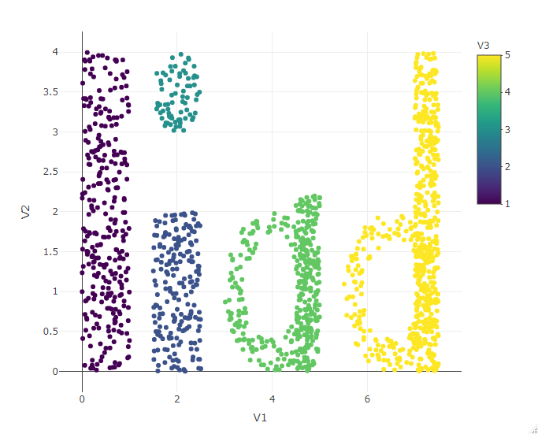

```{r setup, include=FALSE}
knitr::opts_chunk$set(echo = TRUE)
```

# Wprowadzenie

W celu przetestowania skuteczności różnych algorytmów analizy skupień, stworzyłem trzy zbiory testowe: dwa w $\mathbb{R}^2$
oraz jeden w $\mathbb{R}^3$. Zbiory przedstawiają różne ciekawe kształty, a sposób ich tworzenia został opisany poniżej.

## Rysowanie wykresów

Benchmarkowe zbiory danych zostaną przedstawione za pomocą wykresów stworzonych przy pomocy biblioteki *Plotly*.
Dla wygodnego tworzenia owych ilustracji w naszym przypadku, stworzona została pomocnicza funkcja `maluj()`.
Aby w ładny sposób przedstawić grafiki, można skorzystać z biblioteki *Webshot* bądź wstawić wcześniej przygotowane grafiki.
Ze względów estetycznych, skorzystałem z drugiej opcji.

```{r libraries, message=FALSE, echo = FALSE}
#wczytanie odpowiednich bibliotek
library(plotly) 
library(movMF)
```

```{r funkcja maluj, cache=TRUE, include=FALSE}

maluj <- function(X, X.l){
  require(plotly)
  if(ncol(X)==2){
    C <- X
  for(i in 1:max(X.l)){
  C[X.l==i, 3] <- i
  }
  p <- plot_ly(C, x = ~V1, y = ~V2, color = ~V3 ) %>%
    add_markers()
  }
  if(ncol(X)==3){
    C <- X
    for(i in 1:max(X.l)){
      C[X.l==i, 4] <- i
    }
    p <- plot_ly(C, x = ~V1, y = ~V2, z = ~V3, color = ~V4) %>%
      add_markers()
  }
  if(!ncol(X) %in% c(2, 3)){
   print("Wybacz, nie wiem jak to namalować")
   p <- NULL
  }
  p
}

```


\newpage
# Własne zbiory benchmarkowe

## Pierwszy zbiór

Przy stworzeniu pierwszego zbioru danych skorzystałem ze wskazówek znalezionych na stronie internetowej `www.r-bloggers.com` oraz
biblioteki *movMF* - z pomocą której można skorzystać z rozkładu von Mises-Fischera. Dzięki temu stworzone zostały kształty przypominające okręgi w układzie współrzędncyh. Zbiór zawiera 600 punktów w 2 wymiarach oraz 3 skupienia.  

```{r benchmark2, echo=FALSE, fig.width=8}
MFData <- function(n, theta, cluster, scale=1) {
  require(movMF)
  data <- rmovMF(n, theta)
  data <- data.frame(data[,1], data[,2]) 
  data <- data * scale
  colnames(data) <- c("V1", "V2")
  data[,3] <- rep(cluster, nrow(data))
  data
}

data1 <- MFData(200, 0.2 * c(-1, 1), 1, 5)
data2 <- MFData(100, 3 * c(1, -1), 2, 1)
data3 <- MFData(300, 0.6 * c(-1, 1), 3, 10)
prebenchmark2 <- rbind(data1, data2, data3)
benchmark2 <- prebenchmark2[,1:2]
benchmark2.l <- data.frame(as.double(prebenchmark2[,3]))
colnames(benchmark2) <- c("V1", "V2")
```




\newpage

## Drugi zbiór

Drugi zbiór benchmarkowy został stworzony w $\mathbb{R}^3$. Przedstawia sześcian wewnątrz większej bryły. Bryła ta także jest w kształcie sześcianu, jednak z wyciętą wewnątrz kulą. Zbiór zawiera około 800 wylosowanych punktów tworzących wyżej opisany kształt 
oraz 2 skupienia. W celu lepszej wizualizacji został przedstawiony za pomocą dwóch grafik.

```{r benchmark3, echo=FALSE, cache = TRUE}
kostka <- cbind(runif(800, -1, 1), runif(800, -1, 1), runif(800, -1, 1))
kostka <- data.frame(kostka)
colnames(kostka) <- c("V1", "V2", "V3")

kostka[sqrt(kostka[,1]**2+kostka[,2]**2+kostka[,3]**2)>0.9,] -> obramowanie


malakostka <- cbind(runif(300, -0.3, 0.3), runif(300, -0.3, 0.3), runif(300, -0.3, 0.3))
malakostka <- data.frame(malakostka)
colnames(malakostka) <- c("V1", "V2", "V3")
benchmark3 <- rbind(malakostka, obramowanie)

benchmark3.l <- data.frame(c(rep(1, 300), rep(2, nrow(benchmark3)-300)))
```


  

\newpage  

## Trzeci zbiór

Ostatni zbiór danych jest puszczeniem oczka w stronę wszystkich osób związanych z naszym kierunkiem. Przy prezentacji jego w układzie współrzędnych ukazuje nam się napis "Iiad". Trzeci zbiór benchmarkowy składa się z ok. 1550 dwuwymiarowych punktów w 5 skupieniach.

```{r benchmark 4, echo=FALSE, cahe = TRUE}
I <- cbind(runif(300, 0, 1), runif(300, 0, 4))
kropka <- cbind(runif(100, 1.5, 2.5), runif(100, 3, 4))
kropka[sqrt((kropka[,1]-2)**2+(kropka[,2]-3.5)**2)<0.5,] -> kropka
i <- cbind(runif(200, 1.5, 2.5), runif(200, 0, 2))
a01 <- cbind(runif(400, 3, 5), runif(400, 0, 2))
a01[sqrt((a01[,1]-4)**2+(a01[,2]-1)**2)<1 & sqrt((a01[,1]-4)**2+(a01[,2]-1)**2)>0.6,] -> a01
a02 <- cbind(runif(200, 4.5, 5), runif(200, 0, 2.2))
a <- rbind(a01, a02)

d01 <- cbind(runif(400, 5.5, 7.5), runif(400, 0, 2))
d01[sqrt((d01[,1]-6.5)**2+(d01[,2]-1)**2)<1 & sqrt((d01[,1]-6.5)**2+(d01[,2]-1)**2)>0.6,] -> d01
d02 <- cbind(runif(400, 7, 7.5), runif(400, 0, 4))
d <- rbind(d01, d02)


rbind(I, i, kropka, a, d) -> Iiad
benchmark4 <- data.frame(Iiad)
colnames(benchmark4) <- c("V1","V2")
benchmark4.l <- data.frame(c(rep(1, 300), rep(2, 200), rep(3, nrow(kropka)), rep(4, nrow(a)), rep(5, nrow(d))))
```



\pagebreak

# Sprawdzenie algorytmów analizy skupień

Zgodnie z treścią polecenia, przeprowadzimy teraz test róznych algorytmów na samodzielnie stworzonych testowych zbiorach danych.
Skorzystałem z pomocy przygotowanej w tym celu funkcji `test_bench()`. Efektywność algorytmów sprawdzana była za pomocą 
indeksu Fowlkesa-Mallowsa oraz skorygowanego indeksu Randa.


Sprawdzimy wpierw, czy standaryzacja danych poprawia skuteczność algorytmów.

```{r mine, echo=FALSE, cache=TRUE, messaeg = FALSE}
options(stringsAsFactors = FALSE)
read.csv("mine.csv") -> minecsv   #skorzystamy z wczesniej przygotowanych wyników
rownames(minecsv) <- minecsv[,1]
minecsv <- minecsv[,-1]

sapply(split(unlist(minecsv), rep(c(1, 2), each=length(unlist(minecsv))/2)), mean) -> scaledornot
data.frame(round(scaledornot, 5)) -> DF
rownames(DF) <- c("przed standaryzacją", "po standaryzacji")
colnames(DF) <- "Średni indeks"
knitr::kable(DF)
```

Jak widać - standaryzacja danych wpłynęła minimalnie niekorzystnie na skuteczność badanych metod analizy skupienia.  
W takim razie sprawdzimy które sposoby były najskuteczniejsze na danych nieskalowanych. 
Poniżej przedstawiono dziesięć najlepszych algorytmów pod względem średnich współczynników czterech testów.

```{r bestalgnotscaled, echo = FALSE}

lapply(split(unlist(minecsv[,1:(ncol(minecsv)/2)]), rep(1:23, each=3)) , mean) -> algnotscaled
attr(algnotscaled, "names") <- c("HComplete", "HWardD", "HWardD2", "HSingle", "HAverage", "HMcQuitty", "HMedian", "HCentroid", "Genie", "Genie0.2", "Genie0.4", "Genie0.5", "Genie0.6", "Genie0.7", "ASingle", "ownq1", "own2q", "own3q", "own5", "own10", "own12", "own15", "own")

sort(unlist(algnotscaled), decreasing = TRUE) -> bestalgnotscaled
knitr::kable(t(bestalgnotscaled[1:10]), format = "latex")
```

Algorytmy `Single` z rodziny `hclust()` i biblioteki `cluster` oraz `Genie` dla progów (*threshold*) 0.5, 0.6, 0.7  poradziy sobie z zadaniem najlepiej. Skuteczność ich działania wynosiła 100%. Kolejne miejsca zajęły inne wersje `genie`, a także własne implementacje algorytmu spektralnego, korzystającego odpowiednio z: 12 i 15 sąsiadów.  
Sprawdźmy wyniki najlepszej wersji algorytmu spektralnego - `own12`:

```{r HSingle, echo=FALSE }
minecsv[,c(21,44,67,90)] -> geniescore
lapply(split(unlist(geniescore), 1:3), mean) -> geniemeans
attr(geniemeans, "names") <- c( "benchmark1", "benchmark2", "benchmark3")
barplot(unlist(geniemeans), col= "#1070C4")
```
Jak możemy zauważyć, najgorzej sobie poradził ze zbiorem nr 3.  

Oto wizualizacja efektów jego działania na owych danych:  
  
Niestety, algorytm postanowił rozdzielić pierwszą literę `I` na dwa skupienia oraz połączyć literę "a", dół "d" oraz kropkę nad "i".   
  
A które ze zbiorów okazały się najtrudniejsze do zbadania dla algorytmów?  
```{r przewidywalnosc, echo = FALSE}
lapply(split(unlist(minecsv),1:3), mean) -> przew

attr(przew, "names") <- c( "benchmark1", "benchmark2", "benchmark3")
barplot(sort(unlist(przew), decreasing=TRUE), col="#1070C4", ylim=c(0,0.7))

```
Okazuje się, że całościowo, średnio algorytmy najlepiej radziły sobie z trzecim zbiorem danych, z którym nie najlepiej poradził sobie chociażby `own12`. Najgorzej wypadły trzy okręgi ze zbioru nr 1.